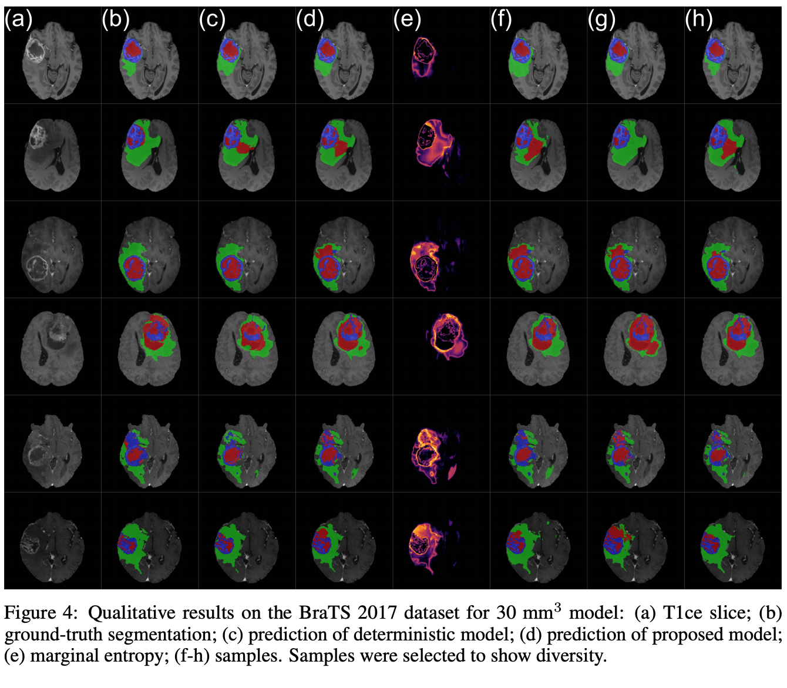

## Stochastic Segmentation Networks

[](https://arxiv.org/abs/2006.06015)
[](https://colab.research.google.com/github/MiguelMonteiro/stochastic_segmentation_networks_demo/blob/master/ssn_demo.ipynb)




[\[Paper\]](https://arxiv.org/abs/2006.06015)
[\[Interactive Demo\]](https://colab.research.google.com/github/MiguelMonteiro/stochastic_segmentation_networks_demo/blob/master/ssn_demo.ipynb)

This repository contains the code for the paper:
> Monteiro, M., Folgoc, L., Castro, D.C., Pawlowski, N., Marques, B., Kamnitsas, K., van der Wilk, M. and Glocker, B., _Stochastic Segmentation Networks: Modelling Spatially Correlated Aleatoric Uncertainty_, 2020 [[arXiv]](https://arxiv.org/abs/2006.06015)


If you use our code in your publications, please consider citing our paper:
```
@article{monteiro2020stochastic,
    title={Stochastic Segmentation Networks: Modelling Spatially Correlated Aleatoric Uncertainty},
    author={Monteiro, Miguel and Le Folgoc, Lo\"{i}c and Castro, Daniel C. and Pawlowski, Nick and Marques, Bernardo and Kamnitsas, Konstantinos and van der Wilk, Mark and Glocker, Ben},
    year={2020},
    eprint = {arXiv:2006.06015}
}
```

### Requirements
Install the necessary requirements on your environment of choice:

    pip install requirements.txt

### BraTS 2017 
To download the data, go to [this page](https://www.med.upenn.edu/sbia/brats2017/registration.html) and follow the instructions provided by the challenge's organisers. 
Run the following script to preprocess the data (`input-dir` should contain folders `HGG` and `LGG` inside):

    python evaluation/preprocessing.py --input-dir <path-to-input-dir> --output-dir <path-to-output-dir>

This script will also split the data into the splits we have used in the paper. 
See folder `assets/BraTS2017_data` after preprocessing.
If you use this model for other data, notice how we calculate binary brain masks. These are necessary for two reasons:
1) The model is training on patches, and so we need to know where the brain is to sample patches inside the brain and avoid sampling patches containing only air.
2) A limitation of our method is that is it is numerically unstable in areas with infinite covariance such as the air outside the brain.
To avoid exploding covariance, we mask out the outside of the brain when computing the covariance matrix.

#### Training
To train the stochastic segmentation networks run:

    python ssn/train.py --job-dir jobs/rank_10_mc_20_patch_110/train \
    --config-file assets/config_files/rank_10_mc_20_patch_110.json \
    --train-csv-path assets/BraTS2017_data/data_index_train.csv \
    --valid-csv-path assets/BraTS2017_data/data_index_valid.csv \
    --num-epochs 1200 \
    --device 0 \
    --random-seeds "1"

You can change the `job-dir` to whatever you like and use the different config files provided to run the baseline and larger model described in the paper.
As described in the paper, we found no benefit in using the model with the larger patch for this application. 
Set `--device` to the index of the GPU you wish to use or to `"cpu"`.
    
**Important:** do not use the numbers printed in the console during training for evaluation. 
They are computed on patches, not on full images.

#### Inference
For inference run:

    python ssn/inference.py --job-dir jobs/rank_10_mc_20_patch_110/test \
    --config-file assets/config_files/rank_10_mc_20_patch_110.json \
    --test-csv-path assets/BraTS2017_data/data_index_test.csv \
    --device 0 \
    --saved-model-paths "assets/saved_models/rank_10_mc_20_patch_110.pt"

You will need to change the `config-file` and `saved-model-paths` according to the model being used.
You can find the pre-trained models in the folder `assets/saved_models`.
The inference script will output the mean of the distribution as the prediction as well as the covariance diagonal and covariance factor.

#### "Covariance became not invertible using independent normals for this batch!"

This message occurs when a patch containing a lot of background is fed to the model.
During inference, you do not need to worry about this since it does not change the final results in any way. 
It just means that we are processing the air around the brain. 
During training this message can **very rarely** occur when a patch is sampled contained a lot of background. 
When this occurs, we decided to use independent normal distributions to prevent the code from crashing altogether.
If during training with new data, you see this message occur very frequently, please consider changing your ROI masks. 

#### Evaluation and Sampling
To generate samples and evaluate your predictions, run: 

    python evaluation/evaluate.py --path-to-prediction-csv jobs/rank_10_mc_20_patch_110/test/predictions/prediction.csv
     
The results of the evaluation will be stored in the same folder as the `prediction.csv` file.
Results are saved to disk, so a second run of the same script takes significantly less time.
Most of the time is spent in computing the generalised energy distance and sample diversity.
If you just want to generate samples without evaluation, run:
    
    python evaluation/generate_samples.py --path-to-prediction-csv jobs/rank_10_mc_20_patch_110/test/predictions/prediction.csv --num-samples 10

For both scripts:
1) Pass `--make--thumbs 1` to generate image thumbnails. 
This produces one vector image (`.svg`) which you can manipulate to generate `png` images (with Inkscape or Illustrator).
2) Pass `--is-deterministic 1` when evaluating the benchmark model, otherwise the code will break.
3) With the deterministic model, pass `--detailed 1` to generate samples from the independent categorical distributions at the end of the network (to illustrate why this is not ideal). This setting will also calculate the sample diversity and generalised energy distance for the single deterministic prediction.
4) With the stochastic models, pass `--detailed 1 --make--thumbs 1` to generate images varying the temperature for each class. See paper and demo for examples.

Note that passing `--detailed 1` significantly increases running times.

### Toy problem

To run the toy problem
    
    python ssn/toy_problem.py
    
Pass `--overwrite True` to overwrite previous runs. You can find the output in `jobs/toy_problem`.

### LIDC 2D

The LIDC 2D results presented in the paper were generated using a [fork of the PHi-Seg code](https://github.com/MiguelMonteiro/PHiSeg-code).
Evaluation script is `phiseg_full_evaluation.py`. 
Loss function in `phiseg/phiseg_model.py`.
Model in `phiseg/model_zoo/likelihoods.py`.
Additional configs in `phiseg/experiments`.
You need to modify `config/system.py`, `phiseg_full_evaluation.py` and `phiseg/experiments/*` with your own local paths.